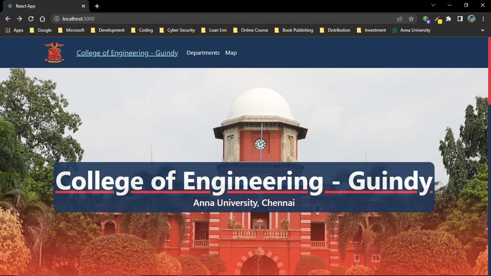
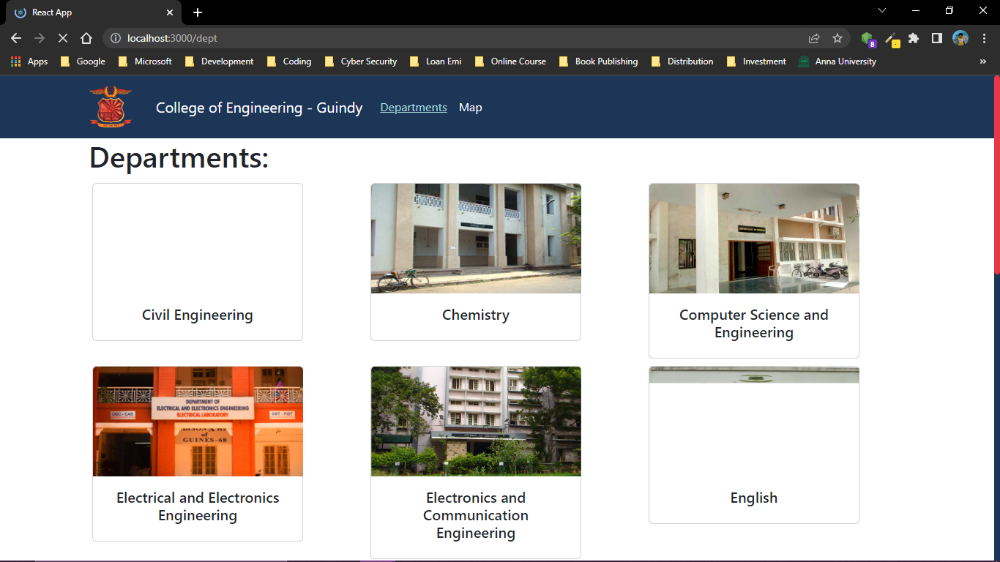
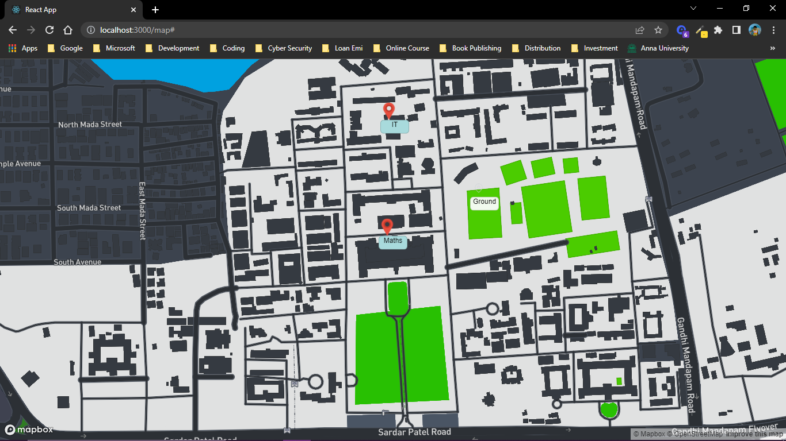

# CEG - a web app for College of Engineering - Guindy

`npm start`

## Developed by:
    Viswanathan P `drummerviswa`

### Web Technologies used
    [Mern Stack]
    - React
    - Node JS
    - Mongo DB
    - Express JS
    - Bootstrap
    - MapBox
    - Google Map

### Model and Examples

    
    
    